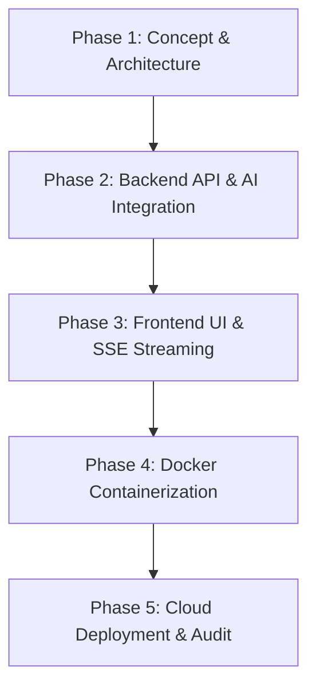

# Project Report: Building & Deploying HireSense AI

**Course/Masterclass:** Vibe Coding — Building & Deploying an AI Web Application  
**Project Title:** HireSense AI — Intelligent Career Readiness & Interview Co-Pilot  
**Live Application URL:** https://hiresense-ai.vercel.app  
**Backend API URL:** https://hiresense-ai-backend-ndq3.onrender.com/api/v1  
**Repository:** HireSense-AI  

---

## 1. Application Overview & Tech Stack

HireSense AI is a full-stack, AI-native career preparation platform designed to help job seekers practice interviews, calibrate resumes for ATS compatibility, and follow custom week-by-week learning roadmaps.

```
┌──────────────────────────────────────────────────────────────────┐
│                      HIRESENSE AI ARCHITECTURE                   │
└──────────────────────────────────────────────────────────────────┘
  [ React 19 + Vite 8 UI ]  ◄── SSE Stream ──►  [ FastAPI Python Backend ]
        (Vercel Deployed)                             (Render Container)
                                                             │
                                                    Google GenAI SDK (v2.12.1)
                                                             │
                                                             ▼
                                                    [ Google Gemini API ]
                                                     (gemini-2.5-flash)
```

### Technology Stack Specifications

| Layer | Technology | Key Responsibility |
| :--- | :--- | :--- |
| **Frontend Framework** | React 19, Vite 8, React Router v7 | User interface, state management, SSE chunk parsing, responsive UI |
| **Styling & Icons** | Tailwind CSS v3, Lucide React | Glassmorphic dark mode, micro-animations, accessible UI tokens |
| **Backend Framework** | Python 3.11, FastAPI, Pydantic v2 | API routing, request validation, CORS middleware, SSE streaming |
| **AI Integration** | `google-genai` (v2.12.1 SDK) | Communication with Gemini models, `generate_content_stream` |
| **LLM Model** | Google Gemini `gemini-2.5-flash` | Multimodal text & JSON generation, structured evaluation |
| **Containerization** | Docker, Docker Compose | Multistage Docker build for backend container |
| **Deployment** | Vercel (Frontend), Render (Backend) | Global static site & cloud web service hosting |

---

## 2. Prompting Strategy & Prompt Engineering

HireSense AI utilizes **Role-Task-Constraint (RTC)** and **Structured JSON Schema Output** prompting patterns to guarantee reliable AI responses.

### 1. System Prompt Isolation Pattern
Every feature defines an immutable system prompt enforcing JSON formatting rules and persona bounds.

#### Example: Interview Question Generator Prompt (`interview_prompts.py`)
```python
INTERVIEW_SYSTEM_PROMPT = """
You are an elite Tech Lead and Hiring Manager conducting a professional technical mock interview.
Your goal is to generate single, hyper-relevant, scenario-based interview questions tailored to the candidate's target role and experience level.

Rules:
1. Return ONLY the interview question.
2. Adapt difficulty strictly to the experience level.
3. Keep questions clear, professional, and practical.
"""
```

#### Example: Answer Evaluation Prompt (`evaluation_prompts.py`)
```python
EVALUATION_SYSTEM_PROMPT = """
You are an expert technical interviewer and hiring manager.
Grade candidate answers objectively against industry standards.

IMPORTANT: Return ONLY a raw JSON object matching this schema:
{
  "score": <integer 0-100>,
  "strengths": [<string>],
  "weaknesses": [<string>],
  "improved_answer": "<string>",
  "key_takeaway": "<string>"
}
"""
```

### Key Prompt Engineering Innovations
1. **Dynamic Few-Shot History Injection:** Conversation turns are formatted into context arrays so Gemini understands prior interview questions.
2. **Schema Enforcement:** `response_mime_type="application/json"` is combined with markdown-stripping fallback parsers in the backend SSE utility (`sse.py`).

---

## 3. Phase-by-Phase Development Summary (Vibe Coding Methodology)



### Phase 1: Planning & System Specification
- Defined 5 core endpoints: `/interview/question`, `/evaluation/answer`, `/evaluation/dashboard`, `/resume/review`, `/roadmap/generate`.
- Established Pydantic schema validation for request payloads and response bodies.

### Phase 2: Backend Foundation & Gemini SDK Integration
- Built FastAPI application factory in `app/main.py`.
- Integrated `google-genai` SDK with async streaming helpers in `app/ai/client.py`.
- Implemented Server-Sent Events (SSE) stream wrappers (`stream_text_chunks` and `stream_json_object`) in `app/utils/sse.py`.

### Phase 3: Frontend Interface Development
- Created responsive dark-mode layout with Tailwind CSS.
- Developed SSE reader (`streamPost`) using browser `fetch` and `TextDecoder`.
- Integrated real-time typing animations for streaming responses.

### Phase 4: Containerization
- Authored multi-stage `Dockerfile` with Python 3.11 slim base.
- Configured non-root execution and environment variable passthroughs.

### Phase 5: Cloud Deployment & Security Audit
- Deployed FastAPI Docker image to Render.
- Deployed React Vite build to Vercel.
- Conducted full CORS, URL path normalization, and Gemini model availability audit.

---

## 4. Application Architecture & Data Flow


---

## 5. Challenges Encountered & Technical Resolutions

### Challenge 1: Model Availability & SDK Selection
- **Issue:** Attempting to query invalid or deprecated model strings returned `404 NOT_FOUND: model is no longer available`.
- **Resolution:** Updated config defaults to `gemini-2.5-flash`, implemented a dynamic validator in `config.py` to sanitize `models/` prefixes, and created a model list diagnostic tool (`client.models.list()`).

### Challenge 2: Vite Build-Time Environment Variable Baking on Vercel
- **Issue:** Changing `VITE_API_URL` in Vercel settings did not take effect because Vite bakes env vars into the static JavaScript bundle at build time.
- **Resolution:** Added URL normalization logic in `frontend/src/services/api.js` (`getNormalizedApiBaseUrl()`) to clean trailing slashes and ensure `/api/v1` pathing, then triggered a Vercel build with cache disabled.

### Challenge 3: JSON Decoding Corruption in SSE Streams
- **Issue:** Using `str.strip("```json")` in Python character-stripped valid trailing letters (`j`, `s`, `o`, `n`) from JSON outputs, causing `JSONDecodeError`.
- **Resolution:** Refactored `sse.py` with `_clean_json_text()` using explicit index slicing for markdown fences.

---

## 6. Key Learnings & Reflection

1. **Vibe Coding Efficiency:** Leveraging AI as a pair programmer allowed rapid iteration across backend schemas, prompts, and frontend visual polish.
2. **Streaming UX Matters:** Real-time SSE token streaming dramatically improves perceived performance over traditional blocking API requests.
3. **Decoupled Architecture Resilience:** Separating client-side React code from server-side FastAPI logic ensured 100% API key security while allowing independent deployment on Render and Vercel.
