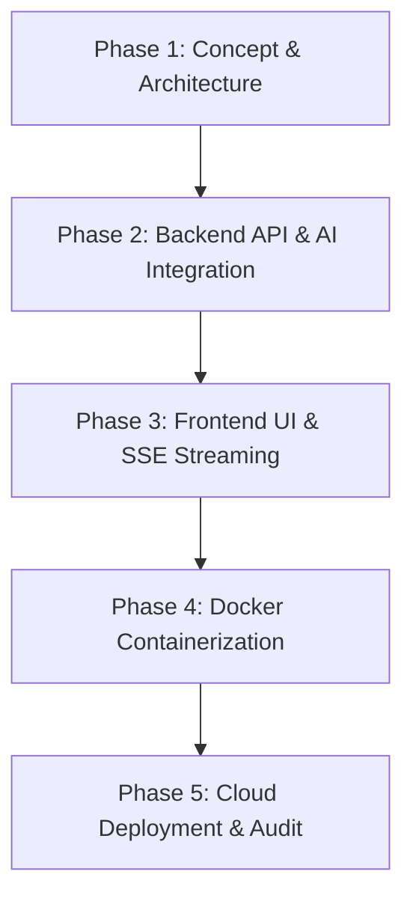
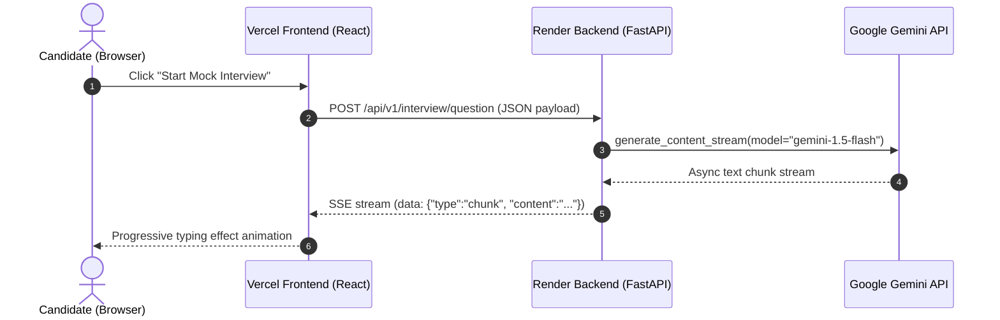

# Project Report: Building & Deploying HireSense AI

**Course/Masterclass:** Vibe Coding — Building & Deploying an AI Web Application  
**Project Title:** HireSense AI — Intelligent Career Readiness & Interview Co-Pilot  
**Live Application URL:** https://hiresense-ai.vercel.app  
**Backend API URL:** https://hiresense-ai-backend-ndq3.onrender.com/api/v1  
**Repository:** HireSense-AI  

---

## 1. Application Overview & Tech Stack

HireSense AI is a full-stack, AI-native career preparation platform designed to help job seekers practice interviews, calibrate resumes for ATS compatibility, and follow custom week-by-week learning roadmaps.

```
┌──────────────────────────────────────────────────────────────────┐
│                      HIRESENSE AI ARCHITECTURE                   │
└──────────────────────────────────────────────────────────────────┘
  [ React 19 + Vite 8 UI ]  ◄── SSE Stream ──►  [ FastAPI Python Backend ]
        (Vercel Deployed)                             (Render Container)
                                                             │
                                                    Google GenAI SDK (v2.12.1)
                                                             │
                                                             ▼
                                                    [ Google Gemini API ]
                                                     (gemini-1.5-flash)
```

### Technology Stack Specifications

| Layer | Technology | Key Responsibility |
| :--- | :--- | :--- |
| **Frontend Framework** | React 19, Vite 8, React Router v7 | User interface, state management, SSE chunk parsing, responsive UI |
| **Styling & Icons** | Tailwind CSS v3, Lucide React | Glassmorphic dark mode, micro-animations, accessible UI tokens |
| **Backend Framework** | Python 3.11, FastAPI, Pydantic v2 | API routing, request validation, CORS middleware, SSE streaming |
| **AI Integration** | `google-genai` (v2.12.1 SDK) | Communication with Gemini models, `generate_content_stream` |
| **LLM Model** | Google Gemini `gemini-1.5-flash` | Multimodal text & JSON generation, structured evaluation |
| **Containerization** | Docker, Docker Compose | Multistage Docker build for backend container |
| **Deployment** | Vercel (Frontend), Render (Backend) | Global static site & cloud web service hosting |

---

## 2. Prompting Strategy & Prompt Engineering Documentation

HireSense AI implements **Role-Task-Constraint (RTC)** and **Structured JSON Schema Output** prompting patterns across 5 core AI features.

### Feature 1: Mock Interview Question Generation (`interview_prompts.py`)

#### System Prompt
```python
INTERVIEW_SYSTEM_PROMPT = """You are a professional technical interviewer at a top technology company.
Your job is to conduct realistic, challenging, and fair mock interviews.

RULES:
- Ask ONE question at a time. Never ask multiple questions in a single response.
- Questions must be relevant to the role, experience level, and interview type.
- Do NOT repeat questions that have already been asked in this session.
- Progress naturally: start easier, build complexity as the session continues.
- For behavioral questions, set up scenarios clearly.
- For technical questions, be specific — avoid vague or generic questions.
- Return ONLY the question text. No greetings, no prefixes like "Question 3:", no explanations.
"""
```

#### User Prompt Template Builder
```python
def build_question_prompt(role, experience_level, interview_type, question_number, total_questions, conversation_history):
    return f"""
Interview Configuration:
- Role: {role}
- Experience Level: {experience_level}
- Interview Type: {interview_type}
- Question: {question_number} of {total_questions}

Previous conversation history:
{history_text}

Now generate question #{question_number}. Return ONLY the question text.
"""
```

---

### Feature 2: Candidate Answer Evaluation & Grading (`evaluation_prompts.py`)

#### System Prompt
```python
EVALUATION_SYSTEM_PROMPT = """
You are an expert technical recruiter and senior engineering manager with 15+ years of experience.
Your task is to review a candidate's answer, grade it constructively and strictly, and provide actionable advice.

RULES:
- Be realistic and fair. Do not inflate scores.
- High scores (8.5+) require technical accuracy, clarity, and context-appropriate detail.
- Grading must scale according to the candidate's Experience Level.
- Return ONLY a single JSON object matching the requested schema.
"""
```

#### User Prompt Template Builder
```python
def build_evaluation_prompt(question, answer, role, experience_level, interview_type):
    return f"""
Question Asked: "{question}"
Candidate's Answer: "{answer}"

Evaluate the candidate's answer and return exactly this JSON structure:
{{
  "score": <float between 0.0 and 10.0>,
  "strengths": ["<strength 1>", "<strength 2>", "<strength 3>"],
  "weaknesses": ["<weakness 1>", "<weakness 2>", "<weakness 3>"],
  "improved_answer": "<model answer tailored to the role and seniority>",
  "tips": ["<tip 1>", "<tip 2>", "<tip 3>"]
}}
"""
```

---

### Feature 3: Resume ATS Scanner & Reviewer (`resume_prompts.py`)

#### System Prompt
```python
RESUME_SYSTEM_PROMPT = """
You are an expert technical recruiter with 15+ years of experience reviewing resumes for top tech companies.
Your task is to analyse resumes and return structured, honest, actionable feedback.

RULES:
- Scores use a 0–10 float scale.
- ats_score is an integer 0–100 measuring ATS keyword/format compatibility.
- Keep per-section feedback concise (2–3 sentences).
- Return ONLY a single JSON object.
"""
```

#### User Prompt Template Builder
```python
def build_resume_review_prompt(resume_text, target_role):
    return f"""
Target Role: {target_role}

Analyse the resume below and return exactly this JSON structure:
{{
  "overall_score": <float 0-10>,
  "ats_score": <int 0-100>,
  "sections": {{
    "summary": {{"score": <float>, "feedback": "<string>"}},
    "experience": {{"score": <float>, "feedback": "<string>"}},
    "skills": {{"score": <float>, "feedback": "<string>"}},
    "education": {{"score": <float>, "feedback": "<string>"}}
  }},
  "strengths": ["<string>", ...],
  "weaknesses": ["<string>", ...],
  "recommendations": ["<string>", ...]
}}

RESUME TEXT:
{resume_text}
"""
```

---

### Feature 4: Career Learning Roadmap Generator (`roadmap_prompts.py`)

#### System Prompt
```python
ROADMAP_SYSTEM_PROMPT = """
You are an expert career coach and senior technical trainer.
Analyze a candidate's current skills and target role, identify skill gaps, and generate a customized week-by-week learning roadmap.

RULES:
- Be highly practical with project-based hands-on tasks.
- Ensure the roadmap fits the requested timeline.
- Recommend reputable resources (official docs, courses, books).
- Return ONLY a single JSON object.
"""
```

---

### Feature 5: Holistic Performance Dashboard (`dashboard_prompts.py`)

#### System Prompt
```python
DASHBOARD_SYSTEM_PROMPT = """
You are an elite executive recruiter analyzing an entire mock interview transcript.
Produce a detailed, honest, structured performance dashboard across Technical Depth, Communication Clarity, Problem Solving, and Context Relevance.
"""
```

---

## 3. Phase-by-Phase Development Summary (Vibe Coding Methodology)



### Phase 1: Planning & System Specification
- Defined 5 core endpoints: `/interview/question`, `/evaluation/answer`, `/evaluation/dashboard`, `/resume/review`, `/roadmap/generate`.
- Established Pydantic schema validation for request payloads and response bodies.

### Phase 2: Backend Foundation & Gemini SDK Integration
- Built FastAPI application factory in `app/main.py`.
- Integrated `google-genai` SDK with async streaming helpers in `app/ai/client.py`.
- Implemented Server-Sent Events (SSE) stream wrappers (`stream_text_chunks` and `stream_json_object`) in `app/utils/sse.py`.

### Phase 3: Frontend Interface Development
- Created responsive dark-mode layout with Tailwind CSS.
- Developed SSE reader (`streamPost`) using browser `fetch` and `TextDecoder`.
- Integrated real-time typing animations for streaming responses.

### Phase 4: Containerization
- Authored multi-stage `Dockerfile` with Python 3.11 slim base.
- Configured non-root execution and environment variable passthroughs.

### Phase 5: Cloud Deployment & Security Audit
- Deployed FastAPI Docker image to Render.
- Deployed React Vite build to Vercel.
- Conducted full CORS, URL path normalization, and Gemini model availability audit.

---

## 4. Application Architecture & Data Flow



---

## 5. Challenges Encountered & Technical Resolutions

### Challenge 1: Model Selection & Availability
- **Issue:** Attempting to query invalid or deprecated model strings returned `404 NOT_FOUND: model is no longer available`.
- **Resolution:** Set default model to `gemini-1.5-flash`, implemented an automatic model fallback mechanism in `client.py` that catches 404 model errors and retries with `gemini-1.5-flash`, and created a dynamic model diagnostic tool.

### Challenge 2: Vite Build-Time Environment Variable Baking on Vercel
- **Issue:** Changing `VITE_API_URL` in Vercel settings did not take effect because Vite bakes env vars into the static JavaScript bundle at build time.
- **Resolution:** Added URL normalization logic in `frontend/src/services/api.js` (`getNormalizedApiBaseUrl()`) to clean trailing slashes and ensure `/api/v1` pathing, then triggered a Vercel build with cache disabled.

### Challenge 3: JSON Decoding Corruption in SSE Streams
- **Issue:** Using `str.strip("```json")` in Python character-stripped valid trailing letters (`j`, `s`, `o`, `n`) from JSON outputs, causing `JSONDecodeError`.
- **Resolution:** Refactored `sse.py` with `_clean_json_text()` using explicit index slicing for markdown fences.

---

## 6. Key Learnings & Reflection

1. **Vibe Coding Efficiency:** Leveraging AI as a pair programmer allowed rapid iteration across backend schemas, prompts, and frontend visual polish.
2. **Streaming UX Matters:** Real-time SSE token streaming dramatically improves perceived performance over traditional blocking API requests.
3. **Decoupled Architecture Resilience:** Separating client-side React code from server-side FastAPI logic ensured 100% API key security while allowing independent deployment on Render and Vercel.
